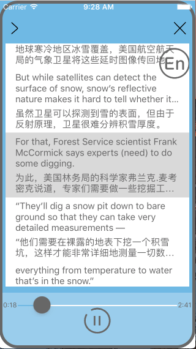
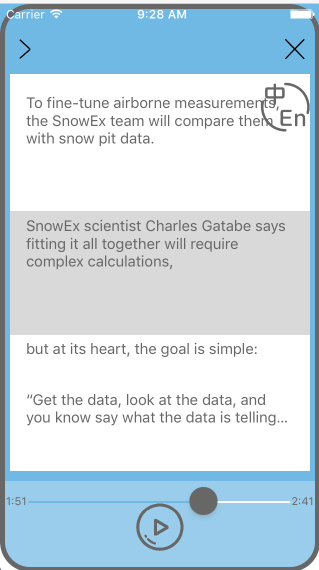

# Voa English
##Introduction

Voa is a practical English learning App,which aims to improve our listening and reading ability.

The project's architecture is easy to understand, following the common software pattern MVC, separating UI, business logic and data model. 

###Current Functions
1.Playing Audio Stream With Custom Audio Playback Interface

2.Playing Video With MPMoviePlayerController

3.Reading Articles

4.Mine（Only Interface）

###TODO
1.Downloading Audio And Video，Offline Playback

2.Custom Video Playback Interface

3.Update UI Design

##Some Screenshots

